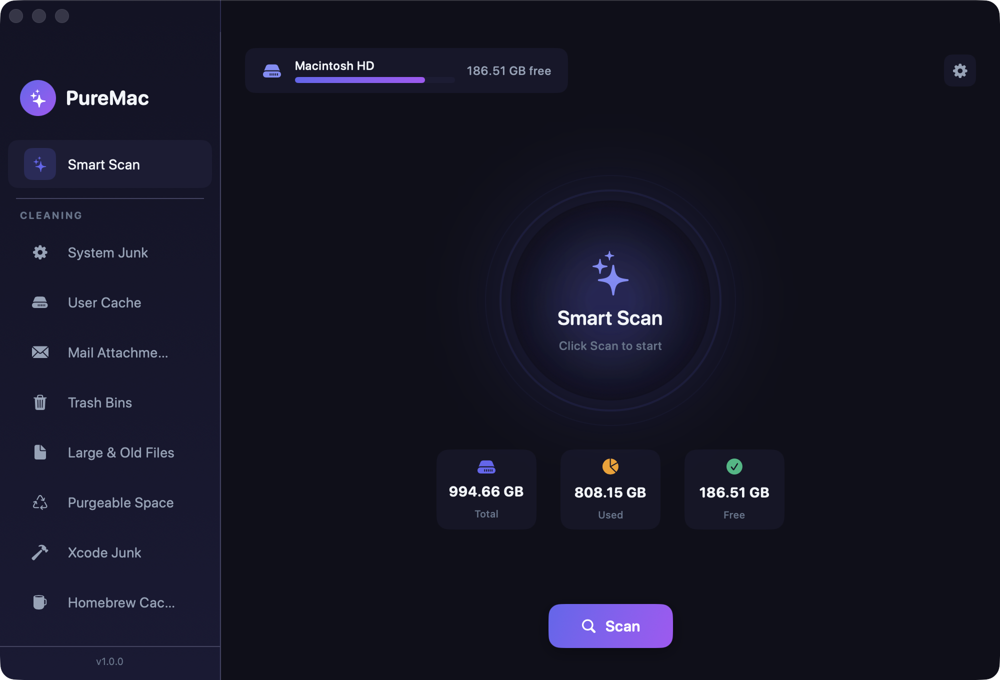

<p align="center">
  
</p>

<p align="center">
  
</p>

<p align="center">
  <b>English</b> |
  <a href="docs/README.ar.md">العربية</a> |
  <a href="docs/README.es.md">Español</a> |
  <a href="docs/README.ja.md">日本語</a> |
  <a href="docs/README.zh-Hans.md">简体中文</a> |
  <a href="docs/README.zh-Hant.md">繁體中文</a>
</p>

<h1 align="center">PureMac</h1>

<p align="center">
  <b>Reclaim your Mac.</b><br>
  Free, open-source uninstaller and cleaner for macOS. No subscription, no telemetry, no upsell.
</p>

<p align="center">
  <a href="https://github.com/momenbasel/PureMac/releases/latest"></a>
  
  
  
  <a href="LICENSE"></a>
  <a href="https://github.com/momenbasel/PureMac/stargazers"></a>
  <a href="https://github.com/momenbasel/PureMac/releases"></a>
</p>

<p align="center">
  <a href="#install">Install</a> -
  <a href="#why-this-exists">Why this exists</a> -
  <a href="#how-it-compares">How it compares</a> -
  <a href="#our-promise">Our promise</a> -
  <a href="#what-it-does">What it does</a> -
  <a href="#permissions">Permissions</a> -
  <a href="#contributing">Contributing</a>
</p>

<p align="center">
  <sub>Want more open source? Try <a href="https://github.com/momenbasel/pesty"><b>Pesty</b></a> - a free, native clipboard manager for macOS.</sub>
</p>

---

## Install

```bash
brew install --cask puremac
```

Or download the signed, notarized `.dmg` from [Releases](https://github.com/momenbasel/PureMac/releases/latest) and drag PureMac into `/Applications`. No Gatekeeper warnings, no quarantine workaround.

### Build from source

```bash
brew install xcodegen
git clone https://github.com/momenbasel/PureMac.git
cd PureMac
xcodegen generate
xcodebuild -project PureMac.xcodeproj -scheme PureMac -configuration Release \
  -derivedDataPath build build
open build/Build/Products/Release/PureMac.app
```

## How it compares

|  | **PureMac** | CleanMyMac | Pearcleaner | Mole | OnyX |
|---|:---:|:---:|:---:|:---:|:---:|
| Price | **Free** | $40+/yr | Free | CLI free / GUI paid | Free |
| Open source | **Yes (MIT)** | No | Source-available¹ | CLI only | No |
| Native Mac GUI | **Yes** | Yes | Yes | Terminal-first | Yes |
| No telemetry | **Yes** | No | Yes | Yes | Yes |
| No subscription | **Yes** | No | Yes | — | Yes |
| Signed + notarized | **Yes** | Yes | Yes | — | Yes |
| App uninstaller + orphans | **Yes** | Yes | Yes | Partial | No |
| Trash-only (recoverable) | **Yes** | Partial | Yes | Partial | No |
| Honest about purgeable space | **Yes** | No | n/a | n/a | n/a |

<sub>¹ Pearcleaner is Apache 2.0 **+ Commons Clause** - source-available but not OSI-approved (you may not sell it). PureMac is true MIT. Comparison reflects publicly documented features as of 2026; corrections welcome via PR.</sub>

## Our promise

A Mac cleaner asks for the deepest permission macOS grants - Full Disk Access - and then deletes your files. That demands a level of trust the category has spent twenty years burning. Here's the contract PureMac holds itself to, and you can verify every line of it in the source:

- **Trash, never `rm`.** Everything PureMac removes goes to the Trash via `FileManager.trashItem`. If it was wrong, you drag it back. Nothing is shredded or unlinked.
- **No telemetry, ever.** No analytics, no crash reporting, no "anonymous usage stats," no network calls to us. The app doesn't know you exist.
- **No fake urgency.** No dramatized "47 GB of junk detected!" badge, no red alarm counters, no "your Mac is at risk." We show you neutral facts and let you decide.
- **No overpromising.** We don't claim to "reclaim purgeable space," "boost RAM," or "speed up your Mac" - things no app can reliably do. See the purgeable-space note below.
- **You review before anything is removed.** Nothing is auto-deleted. Every item shows its real path with Reveal-in-Finder, and high-risk system paths are hard-excluded in code.
- **Auditable.** It's MIT. The exact code that decides what gets removed is in [`PureMac/Services`](PureMac/Services) and [`PureMac/Logic/Scanning`](PureMac/Logic/Scanning). Read it. Fork it. Ship your own.

If PureMac ever adds telemetry, a paywall on core features, or a fear-based scan, it will have become the thing it was built to replace. Hold us to this.

## Why this exists

Apple sells base-model Macs with 256 GB SSDs that you can't upgrade. The Mac mini, the Air, every entry-level MacBook Pro - the drive is soldered down. The next storage tier costs more than a midrange Windows laptop. Once you've paid it, every gigabyte you've already bought matters.

Most Mac cleaners are subscription apps that hide their disk usage behind a paywall, ship telemetry by default, and trade on FUD ("47 GB of junk detected!"). PureMac is the opposite:

- **One-time install.** No subscription, no trial, no account.
- **No telemetry.** It never phones home. It doesn't even know you exist.
- **Open source under MIT.** Read the code, fork it, audit it.
- **Honest scans.** "Junk" means actually-junk: cache directories the OS itself would purge, orphaned files left by apps you've already deleted, broken installer receipts, that 4 GB Xcode DerivedData blob from 2023.
- **Real uninstalls.** Drag an app, see every preference plist, cache folder, container, launch agent and log file it dropped across your library, remove all of it at once.

## What it does

### App Uninstaller
Discovers everything in `/Applications` and `~/Applications`, then uses a 10-level matching engine (bundle ID, team identifier, entitlements, Spotlight metadata, container discovery, company-name heuristics, partial path matches) to find every file the app dropped on your disk. Three sensitivity tiers - Strict, Enhanced, Deep - let you choose how aggressive that match is. Apple system apps are excluded from the uninstall list automatically. You can also right-click any app in Finder and choose **Services → Uninstall with PureMac** to jump straight into its related-files scan.

### Orphan Finder
Walks `~/Library` and surfaces files left behind by apps that no longer exist on disk. The matcher compares against bundle identifiers and normalized names of every installed app, so a leftover `~/Library/Containers/com.foo.bar` from an app you deleted in 2022 shows up clearly.

### System Cleaner
Smart Scan runs every category in parallel. Each category is its own deliberate scanner:

- **System Junk** - system caches, logs, temp files
- **User Cache** - dynamically discovered, no hardcoded app list
- **AI Apps** - Ollama and LM Studio logs, caches, opt-in history cleanup
- **Mail Files** - downloaded mail attachments
- **Trash Bins** - empties all bins, including external volumes
- **Large & Old Files** - >100 MB or older than 1 year (never auto-selected)
- **Xcode Junk** - DerivedData, Archives, simulator caches
- **Brew Cache** - respects custom `HOMEBREW_CACHE`
- **Node Cache** - npm, yarn classic, pnpm content-addressable store
- **Docker Cache** - images, containers, build cache

> **On "purgeable space":** PureMac shows your APFS purgeable space in the storage breakdown for transparency, but it deliberately does **not** list it as junk to delete. Purgeable space is reserved and reclaimed by macOS itself - no third-party app can reliably free it, and even the Finder's purgeable figure is known to be inaccurate. Cleaners that claim to "reclaim purgeable space" are overpromising. We'd rather be honest than impressive.

### Scheduled Cleaning
Optional. Configurable interval (hourly to monthly), with auto-clean threshold so background runs only fire when there's something meaningful to remove.

## Permissions

PureMac needs **Full Disk Access** to read the locations macOS hides from every app by default - Mail downloads, Safari data, the TCC database, protected app containers. Without it, the cleanup categories miss roughly 70% of what they could find and app uninstalls leave behind everything in `~/Library/Containers`.

The first-launch onboarding walks you through granting it with an animated preview of the exact toggle you need to flip. If you skip it, the dashboard surfaces a single-click "Set up" pill. If a cleanup fails because of a permission issue, PureMac opens System Settings, reveals its bundle in Finder so you can drag it into the FDA list, polls the permission state every second, and auto-retries the failed batch the moment you grant access. You never have to re-select anything.

What PureMac does *not* do:
- It does not collect telemetry, crash reports, or usage analytics.
- It does not require a network connection to operate.
- It does not move data anywhere except the Trash.

## Troubleshooting

### Launchpad / Dock shows a stale or dull PureMac icon

macOS aggressively caches app icons in LaunchServices. After a Homebrew **reinstall or upgrade** the Dock and Launchpad can keep showing the old cached icon. PureMac's cask now runs `lsregister -f` on install to refresh it automatically, but if a stale icon persists, reset the cache manually:

```bash
# Clear the icon caches and rebuild the LaunchServices database
sudo rm -rfv /Library/Caches/com.apple.iconservices.store
sudo find /private/var/folders/ \( -name com.apple.dock.iconcache -or -name com.apple.iconservices \) -exec rm -rfv {} \; 2>/dev/null
/System/Library/Frameworks/CoreServices.framework/Versions/A/Frameworks/LaunchServices.framework/Versions/A/Support/lsregister \
  -kill -r -domain local -domain user -domain system
killall Dock; killall Finder
```

Give it a minute to re-seed, then open PureMac once. If it still sticks, a restart (or Safe Mode boot) forces a full rebuild.

## Screenshots

| Onboarding | App Uninstaller |
|---|---|
|  |  |

| System Junk | Xcode Junk |
|---|---|
|  |  |

| User Cache |
|---|
|  |

## Architecture

```
PureMac/
  Logic/Scanning/     - Heuristic scan engine, locations database, conditions
  Logic/Utilities/    - Structured logging
  Models/             - Data models, typed errors
  Services/           - Scan engine, cleaning engine, permission coordinator, scheduler
  ViewModels/         - Centralized app state
  Views/              - Native SwiftUI views
    Apps/             - App uninstaller views
    Components/       - Shared components (FDA demo, permission sheet, theme)
    Orphans/          - Orphan finder
    Settings/         - Native Form-based settings
```

Key components:
- **AppPathFinder** - 10-level heuristic matching engine for discovering app-related files
- **Locations** - 120+ macOS filesystem search paths
- **Conditions** - 25 per-app matching rules for edge cases (Xcode, Chrome, VS Code, etc.)
- **PermissionCoordinator** - Single source of truth for FDA prompts, polling, and post-grant retries
- **FullDiskAccessManager** - TCC probe + registration; broad probe paths (Mail, Safari, Messages, AddressBook, Calendars) so macOS catalogs the bundle reliably
- **CleaningEngine** - Symlink-resistant deletion with an allow-list, NSAppleScript-based admin escalation for root-owned items, NUL-separated path staging for xargs

## Security

- Symlink attack prevention: paths are resolved before validation, re-resolved immediately before unlink to close TOCTOU windows.
- Allow-list cleaning: a path that doesn't sit inside an explicit safe-root is refused, even for the user-level pass.
- Admin escalation is gated by a *narrower* allow-list (app bundles, package receipts, launch plists) than the normal cleaner — root-owned items can only be removed inside those roots.
- System app protection: Apple's bundles cannot be uninstalled, regardless of selection.
- All destructive operations require explicit confirmation by default. The toggle that disables that confirmation is buried in Settings.

If you find a vulnerability, please open a private security advisory rather than a public issue.

## Contributing

Pull requests welcome. See [CONTRIBUTING.md](CONTRIBUTING.md).

Especially welcome:
- Per-category size and date filter presets
- Wider XCTest coverage for `AppState` and the scan engine
- Translations beyond the current set (en, ar, es, ja, pl, pt-BR, ru, uk, zh-Hans, zh-Hant)
- App icon design

## Acknowledgments

- **[@nguyenhuy158](https://github.com/nguyenhuy158)** - Search and filter feature ([#18](https://github.com/momenbasel/PureMac/issues/18), [#29](https://github.com/momenbasel/PureMac/pull/29))
- **[@edufalcao](https://github.com/edufalcao)** - Cleaning safety guards and confirmation dialogs ([#30](https://github.com/momenbasel/PureMac/pull/30))
- **[@zeck00](https://github.com/zeck00)** - UI overhaul ([#31](https://github.com/momenbasel/PureMac/pull/31)), app uninstaller with system app protection ([#32](https://github.com/momenbasel/PureMac/pull/32)), onboarding experience ([#33](https://github.com/momenbasel/PureMac/pull/33))
- **[@0x-man](https://github.com/0x-man)** - Symlink security vulnerability report ([#25](https://github.com/momenbasel/PureMac/issues/25))
- **[@ansidev](https://github.com/ansidev)** - Checkbox interaction bug report ([#34](https://github.com/momenbasel/PureMac/issues/34))
- **[@fengcheng01](https://github.com/fengcheng01)** - App uninstaller feature request ([#28](https://github.com/momenbasel/PureMac/issues/28))
- **[@scholzfuni](https://github.com/scholzfuni)** - Modularization proposal ([#23](https://github.com/momenbasel/PureMac/issues/23))
- **[@Zonharo](https://github.com/Zonharo)** - In-app auto-update request ([#94](https://github.com/momenbasel/PureMac/issues/94))

## Star History

If PureMac saved you some disk space, a star helps other people find it.

<a href="https://star-history.com/#momenbasel/PureMac&Date">
  <picture>
    <source media="(prefers-color-scheme: dark)" srcset="https://api.star-history.com/svg?repos=momenbasel/PureMac&type=Date&theme=dark" />
    <source media="(prefers-color-scheme: light)" srcset="https://api.star-history.com/svg?repos=momenbasel/PureMac&type=Date" />
    
  </picture>
</a>

## More open source

- **[Pesty](https://github.com/momenbasel/pesty)** - a free, open-source clipboard manager for macOS. Color-coded history, pinboards, instant search, keyboard-fast paste. Signed, notarized, `brew install --cask momenbasel/pesty/pesty`.

## License

MIT. See [LICENSE](LICENSE). Use it, fork it, ship it under your own name if you want - the only thing the license asks is that the notice stays.
