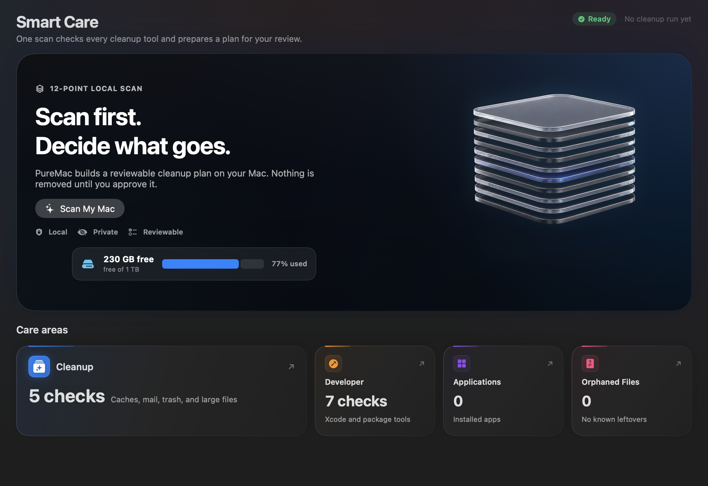
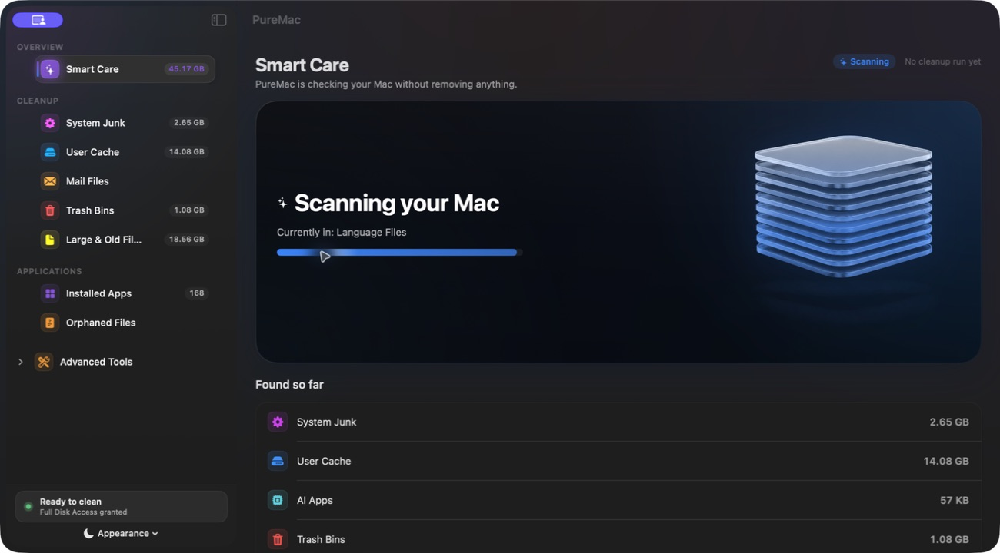
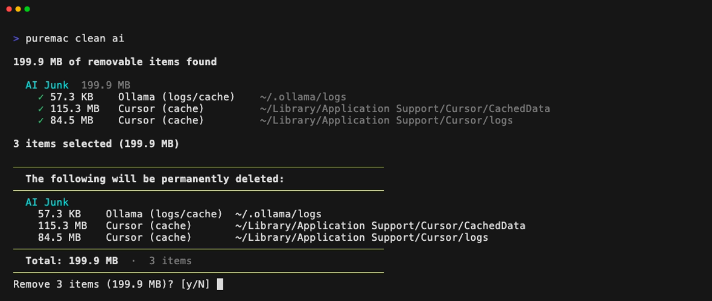

<p align="center">
  
</p>

<p align="center">
  
</p>

<p align="center">
  <a href="../README.md">English</a> |
  <a href="README.ar.md">العربية</a> |
  <a href="README.es.md">Español</a> |
  <a href="README.ja.md">日本語</a> |
  <b>Português (Brasil)</b> |
  <a href="README.zh-Hans.md">简体中文</a> |
  <a href="README.zh-Hant.md">繁體中文</a>
</p>

<h1 align="center">PureMac</h1>

<p align="center">
  <b>Recupere o seu Mac.</b><br>
  Desinstalador e limpador para macOS, gratuito e open-source. Sem assinatura, sem telemetria, sem upsell.
</p>

<p align="center">
  <a href="https://github.com/momenbasel/PureMac/releases/latest"></a>
  
  
  
  <a href="../LICENSE"></a>
  <a href="https://github.com/momenbasel/PureMac/stargazers"></a>
  <a href="https://github.com/momenbasel/PureMac/releases"></a>
</p>

<p align="center">
  <a href="#instalação">Instalação</a> -
  <a href="#por-que-isto-existe">Por que isto existe</a> -
  <a href="#comparativo">Comparativo</a> -
  <a href="#nossa-promessa">Nossa promessa</a> -
  <a href="#o-que-ele-faz">O que ele faz</a> -
  <a href="#permissões">Permissões</a> -
  <a href="#contribuindo">Contribuindo</a>
</p>

<p align="center">
  <sub>Quer mais código aberto? Experimente o <a href="https://github.com/momenbasel/pesty"><b>Pesty</b></a> - um gerenciador de área de transferência nativo e gratuito para macOS.</sub>
</p>

---

## Instalação

```bash
brew install --cask puremac
```

Ou baixe o `.dmg` assinado e notarizado em [Releases](https://github.com/momenbasel/PureMac/releases/latest) e arraste o PureMac para `/Applications`. Sem avisos do Gatekeeper, sem gambiarra de quarentena.

### Compilar do código-fonte

```bash
brew install xcodegen
git clone https://github.com/momenbasel/PureMac.git
cd PureMac
xcodegen generate
xcodebuild -project PureMac.xcodeproj -scheme PureMac -configuration Release \
  -derivedDataPath build build
open build/Build/Products/Release/PureMac.app
```

### Linha de comando (beta)

Prefere o terminal? O `puremac` é um companheiro de linha de comando que
reutiliza as mesmas regras de limpeza e segurança para remover caches de
desenvolvimento, limpar artefatos de build de projetos e analisar o uso do
disco.

```bash
brew install momenbasel/tap/puremac-cli
puremac clean dev --dry-run
```



Consulte [`cli/README.md`](../cli/README.md) para ver a referência completa de comandos.

## Comparativo

|  | **PureMac** | CleanMyMac | Pearcleaner | Mole | OnyX |
|---|:---:|:---:|:---:|:---:|:---:|
| Preço | **Grátis** | US$ 40+/ano | Grátis | CLI grátis / GUI paga | Grátis |
| Código aberto | **Sim (MIT)** | Não | Código-disponível¹ | Só a CLI | Não |
| Interface nativa de Mac | **Sim** | Sim | Sim | Focado no terminal | Sim |
| Sem telemetria | **Sim** | Não | Sim | Sim | Sim |
| Sem assinatura | **Sim** | Não | Sim | — | Sim |
| Assinado + notarizado | **Sim** | Sim | Sim | — | Sim |
| Desinstalador de apps + órfãos | **Sim** | Sim | Sim | Parcial | Não |
| Só Lixeira (recuperável) | **Sim** | Parcial | Sim | Parcial | Não |
| Honesto sobre espaço purgável | **Sim** | Não | n/a | n/a | n/a |

<sub>¹ O Pearcleaner é Apache 2.0 **+ Commons Clause** - código-disponível, mas não aprovado pela OSI (você não pode vendê-lo). O PureMac é MIT de verdade. O comparativo reflete recursos documentados publicamente em 2026; correções são bem-vindas via PR.</sub>

## Nossa promessa

Um limpador de Mac pede a permissão mais profunda que o macOS concede - o Acesso Total ao Disco - e depois apaga os seus arquivos. Isso exige um nível de confiança que a categoria passou vinte anos queimando. Este é o contrato que o PureMac assume consigo mesmo, e você pode verificar cada linha dele no código-fonte:

- **Lixeira, nunca `rm`.** Tudo o que o PureMac remove vai para a Lixeira via `FileManager.trashItem`. Se foi um engano, basta arrastar de volta. Nada é destruído ou desvinculado.
- **Sem telemetria, nunca.** Sem analytics, sem relatórios de falha, sem "estatísticas anônimas de uso", sem chamadas de rede para nós. O app não sabe que você existe.
- **Sem urgência fabricada.** Nenhum selo dramático de "47 GB de lixo detectados!", nenhum contador vermelho de alarme, nenhum "seu Mac está em risco". Mostramos fatos neutros e deixamos você decidir.
- **Sem promessas exageradas.** Não afirmamos "recuperar espaço purgável", "turbinar a RAM" nem "acelerar o seu Mac" - coisas que nenhum app consegue fazer de forma confiável. Veja a nota sobre espaço purgável abaixo.
- **Você revisa antes de qualquer remoção.** Nada é apagado automaticamente. Cada item mostra o caminho real com Revelar no Finder, e caminhos de sistema de alto risco são excluídos de forma fixa no código.
- **Auditável.** É MIT. O código exato que decide o que é removido está em [`PureMac/Services`](../PureMac/Services) e [`PureMac/Logic/Scanning`](../PureMac/Logic/Scanning). Leia. Faça um fork. Publique o seu próprio.

Se algum dia o PureMac adicionar telemetria, um paywall sobre recursos essenciais ou um escaneamento baseado em medo, ele terá se tornado exatamente aquilo que foi criado para substituir. Cobre isso de nós.

## Por que isto existe

A Apple vende Macs de entrada com SSDs de 256 GB que não podem ser expandidos. O Mac mini, o Air, todo MacBook Pro de entrada - o armazenamento vem soldado. O próximo nível de armazenamento custa mais do que um notebook Windows intermediário. Depois de pagar por ele, cada gigabyte que você já comprou importa.

A maioria dos limpadores de Mac são apps por assinatura que escondem o uso do disco atrás de um paywall, embutem telemetria por padrão e lucram com FUD ("47 GB de lixo detectados!"). O PureMac é o oposto:

- **Instalação única.** Sem assinatura, sem trial, sem conta.
- **Sem telemetria.** Ele nunca liga para casa. Nem sequer sabe que você existe.
- **Código aberto sob MIT.** Leia o código, faça fork, audite.
- **Escaneamentos honestos.** "Lixo" significa lixo de verdade: diretórios de cache que o próprio sistema purgaria, arquivos órfãos deixados por apps que você já apagou, recibos de instalação quebrados, aquele blob de 4 GB de DerivedData do Xcode de 2023.
- **Desinstalações de verdade.** Arraste um app e veja cada plist de preferências, pasta de cache, contêiner, launch agent e arquivo de log que ele espalhou pela sua biblioteca - e remova tudo de uma vez.

## O que ele faz

### Desinstalador de apps
Descobre tudo em `/Applications` e `~/Applications` e usa um motor de correspondência de 10 níveis (bundle ID, team identifier, entitlements, metadados do Spotlight, descoberta de contêineres, heurísticas de nome da empresa, correspondências parciais de caminho) para encontrar cada arquivo que o app espalhou pelo disco. Três níveis de sensibilidade - Estrito, Aprimorado e Profundo - permitem escolher o quão agressiva é a correspondência. Apps de sistema da Apple são excluídos automaticamente da lista de desinstalação. Você também pode clicar com o botão direito em qualquer app no Finder e escolher **Serviços → Desinstalar com o PureMac** para ir direto ao escaneamento de arquivos relacionados.

### Localizador de órfãos
Percorre a `~/Library` e revela arquivos deixados para trás por apps que não existem mais no disco. O comparador confere com os bundle identifiers e nomes normalizados de todos os apps instalados, então um `~/Library/Containers/com.foo.bar` esquecido por um app que você apagou em 2022 aparece com clareza.

### Limpador do sistema
O Smart Scan executa todas as categorias em paralelo. Cada categoria é um scanner deliberado e independente:

- **Lixo do sistema** - caches do sistema, logs, arquivos temporários
- **Cache do usuário** - descoberto dinamicamente, sem lista fixa de apps
- **Apps de IA** - logs e caches do Ollama e do LM Studio, limpeza de histórico opcional
- **Arquivos do Mail** - anexos de e-mail baixados
- **Lixeiras** - esvazia todas as lixeiras, incluindo volumes externos
- **Arquivos grandes e antigos** - >100 MB ou com mais de 1 ano (nunca selecionados automaticamente)
- **Lixo do Xcode** - DerivedData, Archives, caches de simuladores e runtimes de simulador baixados (removidos via `simctl runtime delete`; nunca selecionados automaticamente)
- **Cache do Brew** - respeita `HOMEBREW_CACHE` personalizado
- **Cache do Node** - npm, yarn clássico, armazenamento endereçado por conteúdo do pnpm
- **Cache do Docker** - imagens, contêineres, cache de build

> **Sobre o "espaço purgável":** o PureMac mostra o espaço purgável do APFS no detalhamento de armazenamento por transparência, mas deliberadamente **não** o lista como lixo a apagar. O espaço purgável é reservado e recuperado pelo próprio macOS - nenhum app de terceiros consegue liberá-lo de forma confiável, e até o número de espaço purgável do Finder é conhecido por ser impreciso. Limpadores que prometem "recuperar espaço purgável" estão prometendo demais. Preferimos ser honestos a ser impressionantes.

### Limpeza agendada
Opcional. Intervalo configurável (de a cada hora até mensal), com limite mínimo de auto-limpeza para que execuções em segundo plano só disparem quando houver algo significativo a remover.

## Permissões

O PureMac precisa de **Acesso total ao Disco** para ler os locais que o macOS esconde de todos os apps por padrão - downloads do Mail, dados do Safari, o banco de dados do TCC, contêineres protegidos de apps. Sem ele, as categorias de limpeza deixam de encontrar cerca de 70% do que poderiam, e as desinstalações deixam para trás tudo o que está em `~/Library/Containers`.

O onboarding do primeiro uso guia a concessão da permissão com uma prévia animada do exato interruptor que você precisa acionar. Se você pular, o painel exibe uma pílula "Configurar" de um clique. Se uma limpeza falhar por questão de permissão, o PureMac abre os Ajustes do Sistema, revela seu bundle no Finder para você arrastá-lo à lista de Acesso Total ao Disco, monitora o estado da permissão a cada segundo e refaz automaticamente o lote que falhou assim que o acesso é concedido. Você nunca precisa selecionar nada de novo.

O que o PureMac *não* faz:
- Não coleta telemetria, relatórios de falha nem análises de uso.
- Não exige conexão de rede para funcionar.
- Não move dados para lugar nenhum além da Lixeira.

## Solução de problemas

### O Launchpad / Dock mostra um ícone desatualizado ou sem cor do PureMac

O macOS faz cache agressivo de ícones de apps no LaunchServices. Após uma **reinstalação ou atualização** via Homebrew, o Dock e o Launchpad podem continuar exibindo o ícone antigo em cache. O cask do PureMac agora executa `lsregister -f` na instalação para atualizá-lo automaticamente, mas se um ícone desatualizado persistir, redefina o cache manualmente:

```bash
# Limpa os caches de ícones e reconstrói o banco de dados do LaunchServices
sudo rm -rfv /Library/Caches/com.apple.iconservices.store
sudo find /private/var/folders/ \( -name com.apple.dock.iconcache -or -name com.apple.iconservices \) -exec rm -rfv {} \; 2>/dev/null
/System/Library/Frameworks/CoreServices.framework/Versions/A/Frameworks/LaunchServices.framework/Versions/A/Support/lsregister \
  -kill -r -domain local -domain user -domain system
killall Dock; killall Finder
```

Dê um minuto para o cache se repovoar e abra o PureMac uma vez. Se ainda persistir, uma reinicialização (ou boot em Modo de Segurança) força a reconstrução completa.

## Capturas de tela

| Smart Care | Escaneamento ao vivo |
|---|---|
|  |  |

| Detalhamento do escaneamento | Desinstalador de apps |
|---|---|
|  |  |

| Lixo do sistema | Lixo do Xcode |
|---|---|
|  |  |

| Cache do usuário | Onboarding |
|---|---|
|  |  |

## Arquitetura

```
PureMac/
  Logic/Scanning/     - Motor heurístico de escaneamento, banco de locais, condições
  Logic/Utilities/    - Logging estruturado
  Models/             - Modelos de dados, erros tipados
  Services/           - Motor de escaneamento, motor de limpeza, coordenador de permissões, agendador
  ViewModels/         - Estado centralizado do app
  Views/              - Views nativas em SwiftUI
    Apps/             - Views do desinstalador de apps
    Components/       - Componentes compartilhados (demo do FDA, sheet de permissão, tema)
    Orphans/          - Localizador de órfãos
    Settings/         - Ajustes nativos baseados em Form
```

Componentes-chave:
- **AppPathFinder** - motor de correspondência heurística de 10 níveis para descobrir arquivos relacionados a apps
- **Locations** - mais de 120 caminhos de busca do sistema de arquivos do macOS
- **Conditions** - 25 regras de correspondência por app para casos especiais (Xcode, Chrome, VS Code, etc.)
- **PermissionCoordinator** - fonte única da verdade para prompts de FDA, monitoramento e novas tentativas pós-concessão
- **FullDiskAccessManager** - sondagem + registro no TCC; caminhos de sondagem amplos (Mail, Safari, Mensagens, AddressBook, Calendários) para que o macOS catalogue o bundle de forma confiável
- **CleaningEngine** - remoção resistente a symlinks com allow-list, escalonamento de admin via NSAppleScript para itens do root, preparação de caminhos separados por NUL para o xargs

## Segurança

- Prevenção de ataques por symlink: os caminhos são resolvidos antes da validação e re-resolvidos imediatamente antes do unlink para fechar janelas de TOCTOU.
- Limpeza por allow-list: um caminho que não esteja dentro de uma raiz segura explícita é recusado, mesmo na passagem em nível de usuário.
- O escalonamento de admin é limitado por uma allow-list *mais estreita* (bundles de apps, recibos de pacotes, plists de launch) do que a do limpador normal — itens do root só podem ser removidos dentro dessas raízes.
- Proteção de apps do sistema: os bundles da Apple não podem ser desinstalados, independentemente da seleção.
- Toda operação destrutiva exige confirmação explícita por padrão. O interruptor que desativa essa confirmação fica escondido nos Ajustes.

Se você encontrar uma vulnerabilidade, abra um aviso de segurança privado (security advisory) em vez de uma issue pública.

## Contribuindo

Pull requests são bem-vindos. Veja o [CONTRIBUTING.md](../CONTRIBUTING.md).

Especialmente bem-vindos:
- Presets de filtro por tamanho e data em cada categoria
- Cobertura mais ampla de XCTest para o `AppState` e o motor de escaneamento
- Traduções além do conjunto atual (en, ar, es, ja, pl, pt-BR, ru, uk, zh-Hans, zh-Hant)
- Design do ícone do app

## Agradecimentos

- **[@nguyenhuy158](https://github.com/nguyenhuy158)** - Recurso de busca e filtro ([#18](https://github.com/momenbasel/PureMac/issues/18), [#29](https://github.com/momenbasel/PureMac/pull/29))
- **[@edufalcao](https://github.com/edufalcao)** - Salvaguardas de limpeza e diálogos de confirmação ([#30](https://github.com/momenbasel/PureMac/pull/30))
- **[@zeck00](https://github.com/zeck00)** - Reformulação da interface ([#31](https://github.com/momenbasel/PureMac/pull/31)), desinstalador de apps com proteção de apps do sistema ([#32](https://github.com/momenbasel/PureMac/pull/32)), experiência de onboarding ([#33](https://github.com/momenbasel/PureMac/pull/33))
- **[@0x-man](https://github.com/0x-man)** - Relato da vulnerabilidade de segurança com symlinks ([#25](https://github.com/momenbasel/PureMac/issues/25))
- **[@ansidev](https://github.com/ansidev)** - Relato do bug de interação com checkboxes ([#34](https://github.com/momenbasel/PureMac/issues/34))
- **[@fengcheng01](https://github.com/fengcheng01)** - Pedido do recurso de desinstalador de apps ([#28](https://github.com/momenbasel/PureMac/issues/28))
- **[@scholzfuni](https://github.com/scholzfuni)** - Proposta de modularização ([#23](https://github.com/momenbasel/PureMac/issues/23))
- **[@Zonharo](https://github.com/Zonharo)** - Pedido de atualização automática no app ([#94](https://github.com/momenbasel/PureMac/issues/94))

## Histórico de estrelas

Se o PureMac liberou espaço no seu disco, uma estrela ajuda outras pessoas a encontrá-lo.

<a href="https://star-history.com/#momenbasel/PureMac&Date">
  <picture>
    <source media="(prefers-color-scheme: dark)" srcset="https://api.star-history.com/svg?repos=momenbasel/PureMac&type=Date&theme=dark" />
    <source media="(prefers-color-scheme: light)" srcset="https://api.star-history.com/svg?repos=momenbasel/PureMac&type=Date" />
    
  </picture>
</a>

## Mais código aberto

- **[Pesty](https://github.com/momenbasel/pesty)** - um gerenciador de área de transferência gratuito e de código aberto para macOS. Histórico com código de cores, pinboards, busca instantânea, colagem rápida pelo teclado. Assinado, notarizado, `brew install --cask momenbasel/pesty/pesty`.

## Licença

MIT. Veja o [LICENSE](../LICENSE). Use, faça fork, publique com o seu próprio nome se quiser - a única coisa que a licença pede é que o aviso permaneça.
